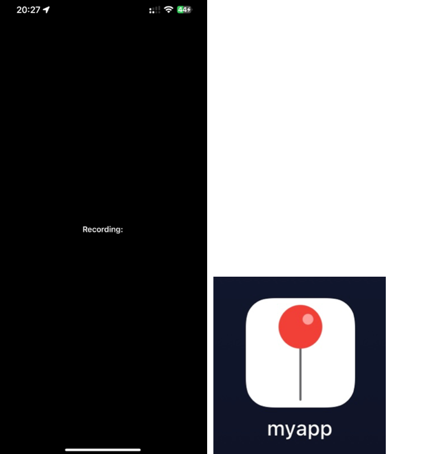
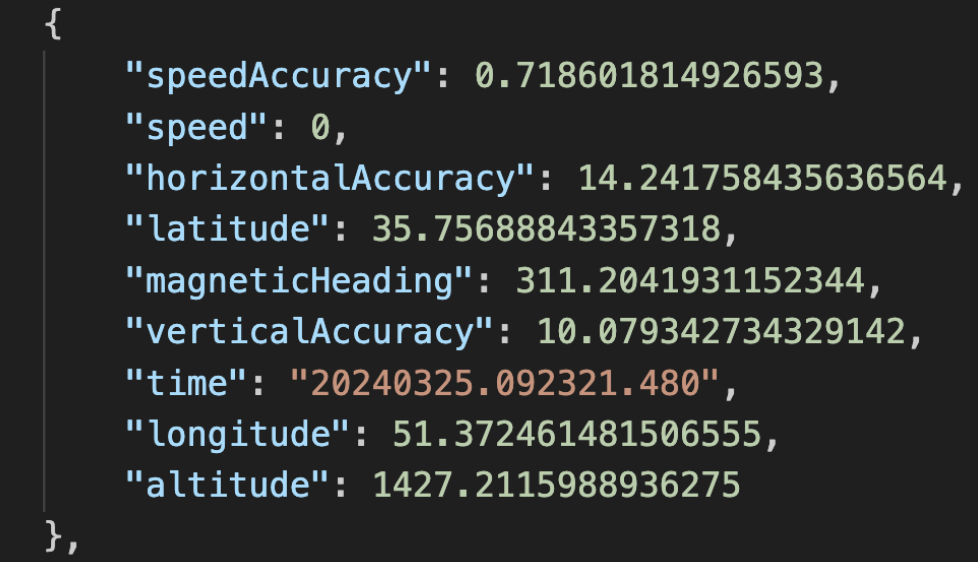

# Overview

<p align="center">
  
</p>

<p align="center" style="margin-top: -10px; margin-left: -20px" >
  Home and Icon
</p>

&nbsp;&nbsp;&nbsp;&nbsp;Myapp is a Swift-based application designed to address the challenge of low geographic data collection rates on iphones. Typically, the geographic data collection rate for iPhones is approximately 1 Hz. This means that even if positional data is collected multiple times per second, it remains identical within each second and is only updated after a full second. This limitation can impact the accuracy of road line registration processes.

## Purpose

&nbsp;&nbsp;&nbsp;&nbsp;To mitigate the effects of low geographic data sampling rates, myapp employs an innovative approach to capture location data at a significantly higher frequency of 50 Hz. Unlike the default behavior where all latitude and longitude readings within a second are identical, this program allows us to precisely determine the exact timestamp when the location data was updated. By capturing data every 20 milliseconds (50 Hz), we can identify the exact moment when the mobile sensor's geographic coordinates were refreshed, enhancing the accuracy of the positional data.


## Features

- **High-Frequency Data Collection:** Records location, speed, and magnetic heading data at 50 Hz (every 20 milliseconds).
- **Accurate Timestamping:** Ensures each data point is accurately timestamped, improving the precision of positional data.
- **Improved Accuracy:** Reduces positional data error from a maximum of 6 meters to a maximum of 12 centimeters for a vehicle traveling at 6 meters per second.

## Installation

1. **Clone the Repository:**

   ```bash
   git clone https://github.com/alirezaghafari/high-frequency-geo-app.git
    ```
2. **Open the Project in XCode**
3. **Run the Application**
4. **Download and Unzip the Container**: To obtain the output, you need to download the app container from within Xcode. 


## Usage

- **Data Collection:** The app continuously records location data every 20 milliseconds and stores it in a JSON file.

## Example Output

Here is a screenshot of the application's output:


<p align="center">
  
</p>

